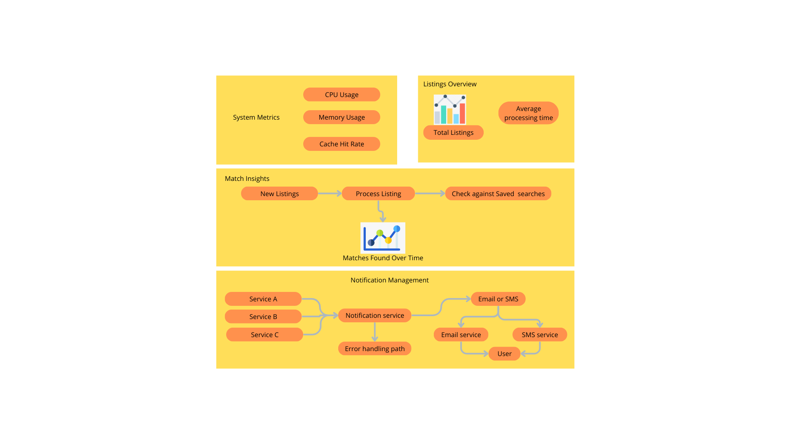

# Rental Platform

## Overview
Rental Platform is a comprehensive solution designed to manage rental listings, match potential tenants, and handle notifications effectively. This project showcases a scalable system architecture suitable for high-volume data environments.

## Features
- **System Metrics**: Monitors CPU usage, memory usage, and cache hit rate.
- **Listings Overview**: Displays the total number of listings and average processing time.
- **Match Insights**: Processes listings to find matches over time with visual representation.
- **Notification Management**: Handles notifications via email and SMS with error handling and retry mechanisms.

## Diagram



## Prerequisites

- Python 3.11
- Docker and Docker Compose
- Redis (for Celery backend)
- PostgreSQL (Database)


### Installation

1. **Clone the Repository**

   Clone the repository to your local machine using Git:

   ```bash
   git clone https://github.com/AnaSofia94/RentalPlatform.git
   cd RentalPlatform
    ```
   
2.	**Install Dependencies with pipenv**

   Install the required Python packages using pipenv, which will also create and activate a virtual environment:

   ```bash
   pipenv install
   ```

3. **Activate the Virtual Environment**

   Activate the virtual environment to run the application:

   ```bash
   pipenv shell
   ```
   
4. **Set up the Database**

  ```bash
   python manage.py migrate
   ```

5. **Run the Application**

Start the backend server:
  ```bash
   python manage.py runserver
   ```

6. **Start Celery Worker**
To run background tasks, you need to start the Celery worker. Open a new terminal window, navigate to your project directory, and run:
    
      ```bash
    celery -A hybel worker --loglevel=info
    ```

### Running with Docker

 1.	**Build and Start the Containers**

Build the Docker images and start the services using Docker Compose:

   ```bash
   docker-compose up --build
   ```

2. **Run migrations**
After the containers are up, run the database migrations:

    ```bash
    docker-compose exec web python manage.py migrate
    ```
   
3. **Create a Superuser**
Create an admin user to access the Django admin interface:
    
    ```bash
    docker-compose exec web python manage.py createsuperuser
    ```
   
4. **Access the Application**

   • Backend: Access the application at http://localhost:8000.
   • Admin Panel: Access the admin panel at http://localhost:8000/admin/.

### Testing

To run the tests, execute the following command:

   ```bash 
   python manage.py test
   ```

Make sure all tests pass before deploying or making significant changes.
